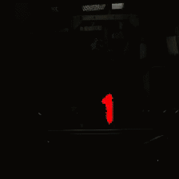

# DigitPose
Image segmentation for digits with a CNN trained via Unity-generated images. The idea is to generate backgrounds randomly and embed digits in the foreground. Use Unity to acquire the correct pose/segmentation mask, train a CNN with the segmentation mask as groundtruth, then deploy on a real system.

# Demo
Below are examples of generated images in Unity:
:-------------------------:|:-------------------------:
  |  

The trained CNN's segmentation when deployed on a real system:

